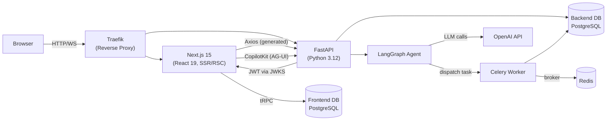
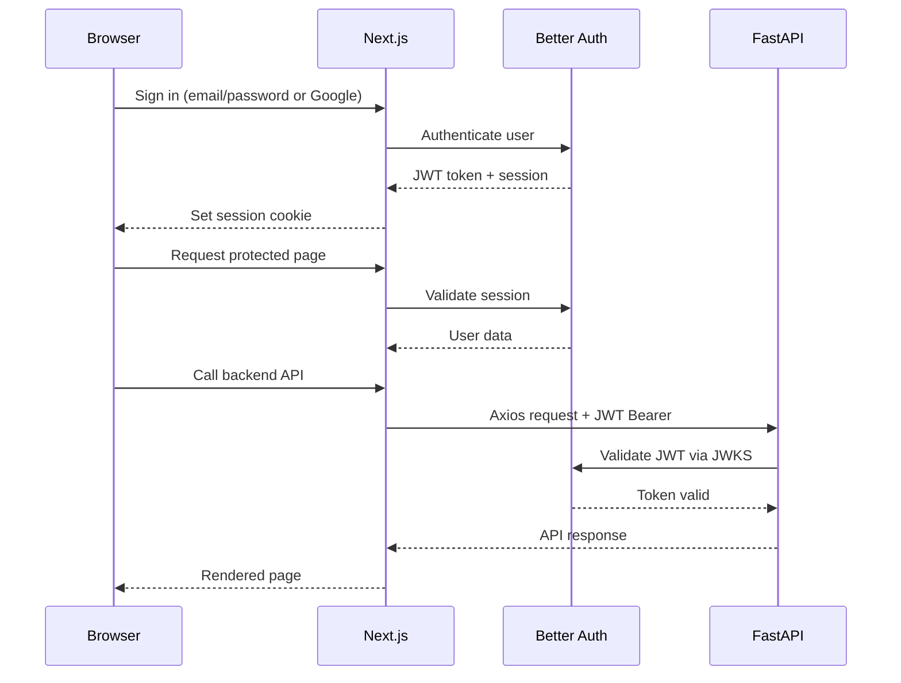
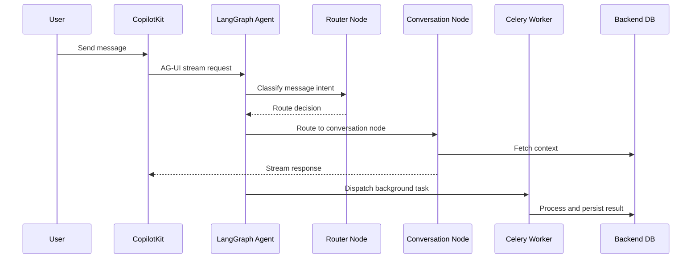
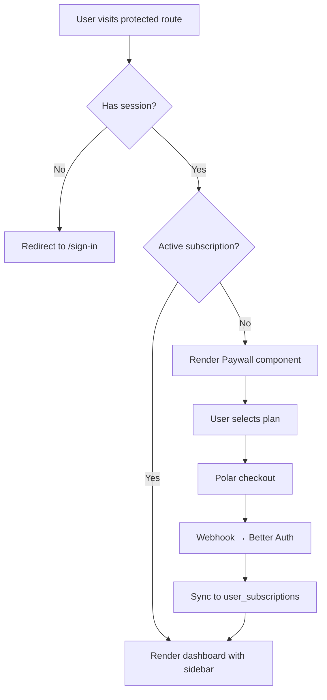
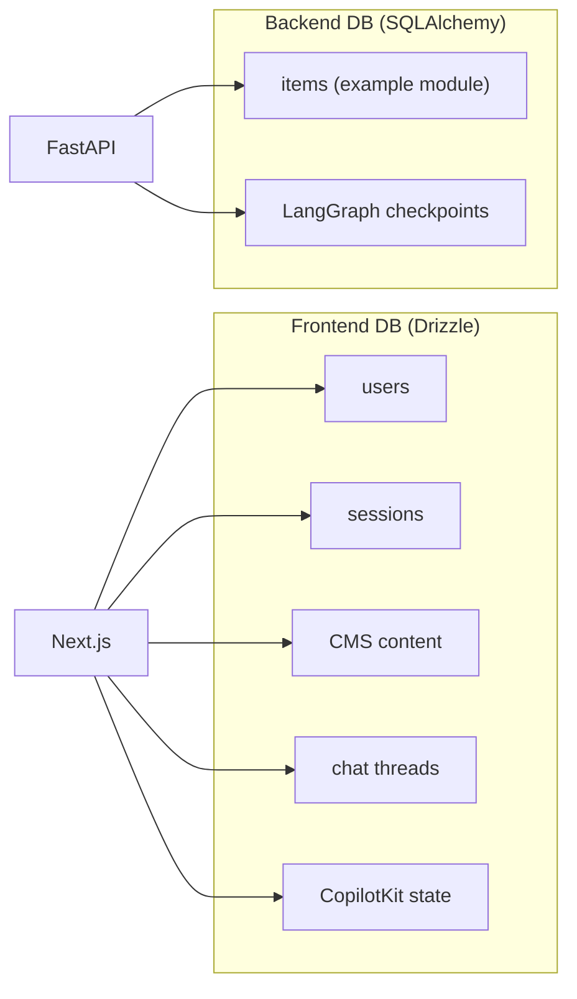

# Architecture Overview

## System Architecture



## Monorepo Structure

```
app/                        # Root (pnpm workspaces + Turborepo)
├── apps/
│   ├── nextjs/             # Next.js 15 frontend (React 19, TypeScript)
│   │   ├── src/
│   │   │   ├── app/                # App Router (i18n: [locale])
│   │   │   │   ├── (app)/[locale]/(protected)/   # Auth-required pages
│   │   │   │   ├── (app)/[locale]/(auth)/        # Public auth pages
│   │   │   │   └── (payload)/admin/              # Payload CMS admin
│   │   │   ├── components/         # React components
│   │   │   ├── hooks/              # Custom hooks
│   │   │   ├── server/             # Server-side code
│   │   │   │   ├── auth/           # Better Auth setup
│   │   │   │   ├── db/             # Drizzle ORM (schemas, migrations)
│   │   │   │   ├── trpc/           # tRPC client setup
│   │   │   │   └── api/            # tRPC routers
│   │   │   ├── lib/                # Utilities
│   │   │   │   ├── api/            # Generated FastAPI client (orval)
│   │   │   │   └── copilotkit/     # CopilotKit integration
│   │   │   └── actions/            # Server actions
│   │   ├── sentry.*.config.ts      # Sentry configs (client, server, edge)
│   │   └── drizzle.config.ts       # DB config
│   ├── fastapi/            # FastAPI backend (Python 3.12)
│   │   ├── api/            # HTTP layer (FastAPI routers + domain modules)
│   │   ├── agents/         # LangGraph agent (state machine, nodes, prompts)
│   │   ├── worker/         # Celery background tasks
│   │   ├── __tests__/      # pytest tests
│   │   ├── migrations/     # Alembic migrations
│   │   └── pyproject.toml  # Poetry dependencies + CLI scripts
│   ├── astro/              # Astro landing page
│   ├── mkdocs/             # MkDocs documentation site
│   ├── storybook/          # Storybook component library
│   ├── keycloak-theme/     # Keycloak theme
│   └── email/              # Email templates
├── packages/
│   ├── ui/                 # shadcn/ui design system (Radix + Tailwind)
│   ├── analytics/          # PostHog analytics (client provider, event constants)
│   ├── email/              # React Email templates + Resend client
│   ├── api-client/         # Generated FastAPI client (Orval)
│   ├── sentry/             # Shared Sentry config
│   ├── eslint-config/      # Shared ESLint
│   ├── prettier-config/    # Shared Prettier
│   └── typescript-config/  # Shared TypeScript
└── e2e/                    # Playwright E2E tests (root level)
```

## Where to Put New Code

| You want to... | Put it in... |
|----------------|-------------|
| Add a new page | `apps/nextjs/src/app/(app)/[locale]/(protected)/` or `(auth)/` |
| Add a React component | `apps/nextjs/src/components/{feature}/` |
| Add a server action | `apps/nextjs/src/actions/` |
| Add a tRPC router | `apps/nextjs/src/server/api/routers/` |
| Add a custom hook | `apps/nextjs/src/hooks/` |
| Add a backend endpoint | `apps/fastapi/api/{module}/routes.py` |
| Add a backend model | `apps/fastapi/api/{module}/models/` |
| Add a backend schema | `apps/fastapi/api/{module}/schemas/` |
| Add a CRUD operation | `apps/fastapi/api/{module}/crud/` |
| Add an agent node | `apps/fastapi/agents/nodes/` |
| Add an agent prompt | `apps/fastapi/agents/prompts/` |
| Add a Celery task | `apps/fastapi/worker/tasks.py` |
| Add a shared UI component | `packages/ui/src/components/` |
| Add an analytics event | `packages/analytics/src/constants.ts` |
| Add an email template | `packages/email/templates/` |
| Add an E2E test | `e2e/{project}/` |
| Add a backend unit test | `apps/fastapi/__tests__/` |

## Communication Flows

### Authentication Flow



### Chat Flow



### Subscription & Paywall Flow



## Two Databases



| Database | ORM | Used By | Contains |
|----------|-----|---------|----------|
| Frontend DB | Drizzle | Next.js + Payload CMS | Users, sessions, OAuth, CMS content, threads, CopilotKit state |
| Backend DB | SQLAlchemy | FastAPI | Application domain data, LangGraph checkpoints |

## Authentication

1. Better Auth (Next.js) handles registration, login, email verification, Google OAuth
2. Better Auth acts as OIDC provider — issues JWTs
3. FastAPI validates JWTs against Better Auth's JWKS endpoint (`/api/auth/.well-known/jwks.json`)
4. All FastAPI endpoints require Bearer token (except /health)

## Key Technologies

| Layer | Tech | Key Files |
|-------|------|-----------|
| Frontend framework | Next.js 15 + React 19 | `apps/nextjs/next.config.ts` |
| Backend framework | FastAPI | `apps/fastapi/api/app.py` |
| Reverse proxy | Traefik | `traefik/` |
| Frontend DB | Drizzle ORM | `apps/nextjs/src/server/db/` |
| Backend DB | SQLAlchemy 2.0 (async) | `apps/fastapi/api/deps/db.py` |
| AI Agent | LangGraph + LangChain | `apps/fastapi/agents/graph.py` |
| Chat UI | CopilotKit | `apps/nextjs/src/lib/copilotkit/` |
| Auth | Better Auth | `apps/nextjs/src/server/auth/auth.ts` |
| Payments | Polar | `apps/nextjs/src/actions/fetch-all-plans.ts` |
| UI Library | shadcn/ui (Radix) | `packages/ui/` |
| API Client | orval (generated) | `packages/api-client/` |
| Email | Resend + React Email | `packages/email/` |
| Analytics | PostHog | `packages/analytics/` |
| Error Tracking | Sentry | `apps/nextjs/sentry.*.config.ts` + `apps/fastapi/api/deps/sentry.py` |
| Task Queue | Celery + Redis | `apps/fastapi/worker/` |
| Monorepo | Turborepo + pnpm | `turbo.json`, `pnpm-workspace.yaml` |
