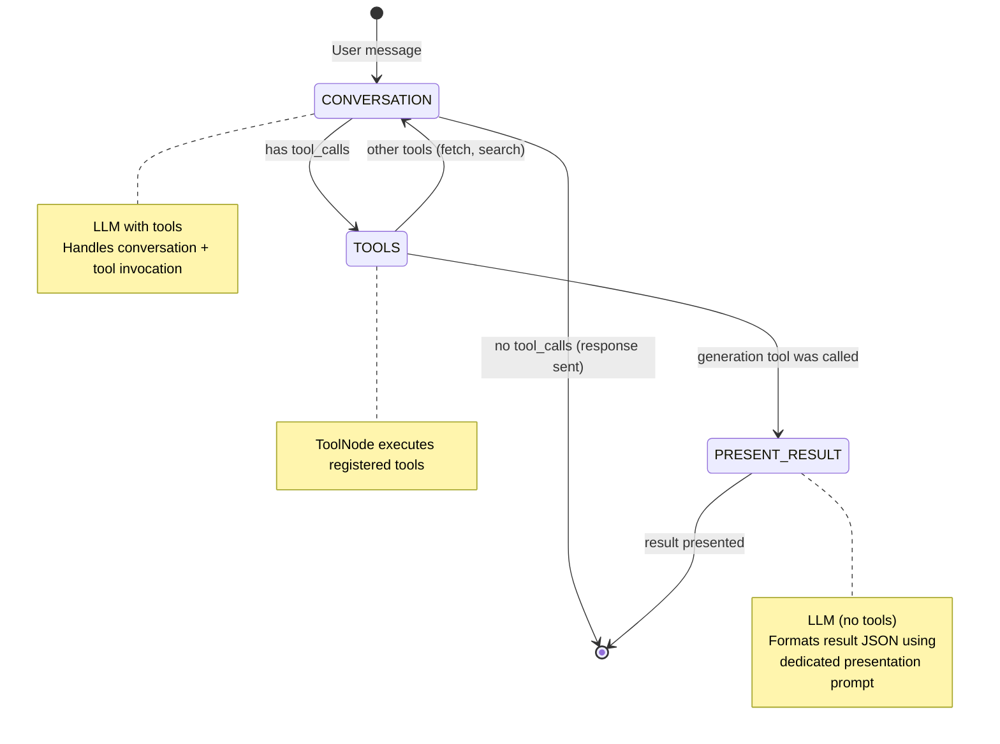

# Agent System Reference — LangGraph

## Overview

The App AI agent is a LangGraph state machine that handles multi-turn conversations. It uses a conversation node with tool-calling to conduct conversations, answer questions, and trigger background tasks. A dedicated `present_result` node handles formatting and streaming structured results back to the user when a generation tool is called.

## Key Files

| File | Purpose |
|------|---------|
| `apps/fastapi/agents/graph.py` | StateGraph definition — nodes, edges, routing |
| `apps/fastapi/agents/state.py` | ChatState TypedDict (Locale, NodeID enums) |
| `apps/fastapi/agents/tools.py` | Agent tools |
| `apps/fastapi/agents/nodes/conversation.py` | Conversation node — builds prompt, invokes LLM with tools |
| `apps/fastapi/agents/nodes/present_result.py` | Result presentation node — formats output into human-readable response |
| `apps/fastapi/agents/checkpointer.py` | Postgres-backed LangGraph state persistence |
| `apps/fastapi/agents/utils.py` | Message processing, transcript helpers |
| `apps/fastapi/api/agents/routes.py` | CopilotKit/AG-UI streaming endpoint (JWT auth) |

## State Machine Flow



The graph uses a **conversation → tools → (present_result | conversation)** flow:

1. User message enters the `conversation` node
2. LLM responds — either with text (→ END) or with tool calls (→ `tools` node)
3. `tools` node executes the called tools and returns results
4. If a generation tool was called → routes to `present_result` node → END
5. If other tools were called (fetch, search) → routes back to `conversation` node

## Graph Definition

```python
# agents/graph.py
def build_graph(checkpointer: BaseCheckpointSaver | None = None):
    g = StateGraph(ChatState)
    g.add_node(NodeID.CONVERSATION, conversation_node)
    g.add_node(NodeID.TOOLS, ToolNode(TOOLS))
    g.add_node(NodeID.PRESENT_RESULT, present_result_node)
    g.set_entry_point(NodeID.CONVERSATION)
    g.add_conditional_edges(
        NodeID.CONVERSATION, tools_condition,
        {NodeID.TOOLS: NodeID.TOOLS, END: END},
    )
    g.add_conditional_edges(
        NodeID.TOOLS, _after_tools_routing,
        {NodeID.PRESENT_RESULT: NodeID.PRESENT_RESULT, NodeID.CONVERSATION: NodeID.CONVERSATION},
    )
    g.add_edge(NodeID.PRESENT_RESULT, END)
    return g.compile(checkpointer=checkpointer)
```

## Agent State

```python
class ChatState(CopilotKitState):
    messages: Annotated[list[BaseMessage], add_messages]
    locale: Locale = Locale.EN
    user_id: UUID
    user_name: str = ""

    # Domain-specific state fields go here
    result_exists: bool = False
    existing_result: dict | None = None
```

## Tool Pattern

Tools use LangChain's `@tool` decorator with injected state and config:

```python
@tool
async def my_tool(
    param: str,
    state: Annotated[dict, InjectedState],
    tool_call_id: Annotated[str, InjectedToolCallId],
    config: RunnableConfig,
) -> Command:
    """Tool description used by the LLM."""
    # Access state: user_id = state["user_id"]
    # Perform work...
    return Command(update={
        "messages": [ToolMessage(content=result, tool_call_id=tool_call_id)],
        # optionally update other state fields
    })
```

**Tool pattern:** All tools return `Command(update={...})` to update graph state. Error cases return `ToolMessage` with error content.

## Result Presentation Node

The `present_result` node formats structured output (returned as a ToolMessage) into a human-readable response streamed to the user. It uses one or more sequential LLM calls with dedicated prompt templates defined in `agents/prompts/`.

```python
# agents/nodes/present_result.py
async def present_result_node(state: ChatState, config: RunnableConfig):
    # 1. Extract result JSON from the last ToolMessage
    # 2. Build presentation prompt
    # 3. Stream formatted response sections to chat
    # 4. Return final AIMessage
```

## Conversation Node

```python
# agents/nodes/conversation.py
async def conversation_node(state: ChatState, config: RunnableConfig):
    # 1. Load any existing domain data from DB
    # 2. Fetch file context (text + images from thread attachments)
    # 3. Build system prompt from local CONVERSATION constant
    # 4. Sanitize message history (last 100, remove orphaned tool messages)
    # 5. Invoke LLM bound with tools: model.bind_tools(TOOLS)
    # 6. Return response (may contain tool_calls → routes to tools node)
```

**Key behaviors:**
- The conversation prompt is a local Python constant in `agents/prompts/conversation.py`
- Langfuse is used for **tracing** (not prompt management)
- Supports multimodal input (images from file attachments)
- Message history windowed to last 100 messages
- Orphaned tool messages (without matching tool call) are removed

## CopilotKit Integration

```python
# api/agents/routes.py
@router.post("/copilotkit/app_agent")
async def app_agent(
    checkpointer: CheckpointerDep,
    input_data: RunAgentInput,
    request: Request,
    user: User = Depends(get_user),
):
    state = dict(input_data.state) if isinstance(input_data.state, dict) else {}
    state["user_id"] = user.id
    state["user_name"] = user.name or ""

    # Locale from X-Locale header
    raw_locale = request.headers.get("x-locale", "").strip().lower()[:2]
    state["locale"] = raw_locale if raw_locale in Locale.__members__.values() else Locale.EN

    modified_input = input_data.model_copy(update={"state": state})
    encoder = EventEncoder(accept=request.headers.get("accept"))

    agent = LangGraphAGUIAgent(
        name="app_agent",
        graph=build_graph(checkpointer),
    )

    async def event_generator():
        async for event in agent.run(modified_input):
            yield encoder.encode(event)

    return StreamingResponse(event_generator(), media_type=encoder.get_content_type())
```

- **Endpoint:** `POST /copilotkit/app_agent`
- **Protocol:** AG-UI (streaming)
- **Auth:** JWT Bearer token (Better Auth)
- **State injection:** `user_id`, `user_name`, `locale` (from `x-locale` header)

## LangGraph Checkpointer (PostgreSQL)

State persisted via `AsyncPostgresSaver` from LangGraph:

- Connection pool: min 2 / max 10 connections
- Autocommit enabled, `dict_row` factory
- Schema created on startup: `CREATE SCHEMA IF NOT EXISTS ...`
- Tables created via `await saver.setup()`
- Dependency function yields checkpointer for injection into routes

## Agent Utilities

```python
# agents/utils.py

# Language-specific instructions for system prompt
get_language_instructions(locale) -> str

# Window message history
get_last_messages(messages, n=100) -> list[BaseMessage]

# Fetch thread file attachments — returns (text_context, image_content_blocks)
# Images: base64-encoded with MIME type
# Text: extracted from documents, wrapped in <file> tags
fetch_thread_files(thread_id) -> tuple[str, list[dict]]

# Convert messages to "user: .../assistant: ..." transcript format
messages_to_transcript(messages) -> str
```

## Prompt Management

All prompts are **local Python constants**, not fetched from external services:

| Prompt Location | Purpose | Used By |
|-----------------|---------|---------|
| `agents/prompts/conversation.py` → `CONVERSATION` | System prompt for conversation (tool invocation + Q&A) | conversation node |
| `agents/prompts/result_presentation.py` | Presentation templates for result formatting | present_result node |

Langfuse is used for **tracing and observability** of all LLM calls, but prompts are managed in code for better version control and review workflows.

## Adding a New Tool

1. Define tool function in `agents/tools.py` with `@tool` decorator
2. Use `Annotated[dict, InjectedState]` to access graph state
3. Return `Command(update={...})` to modify state
4. Add to `TOOLS` list in `agents/nodes/conversation.py`
5. The `ToolNode(TOOLS)` in the graph will automatically execute it

## Adding a New Graph Node

1. Create node function in `agents/nodes/{name}.py`
2. Add `NodeID` enum value in `agents/state.py`
3. Register with `g.add_node(NodeID.MY_NODE, my_node)` in `agents/graph.py`
4. Add edges/conditional edges to define when the node is entered and what follows
