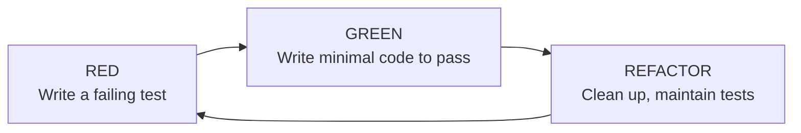
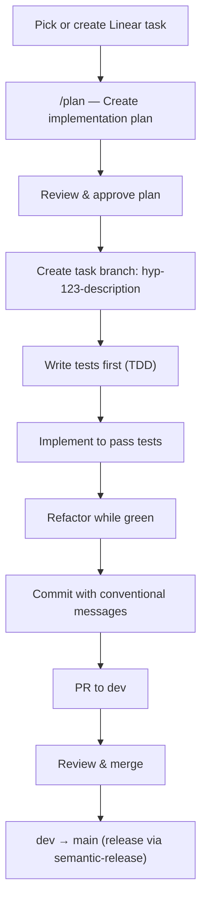

# Coding Conventions

## Test-Driven Development (TDD)

**We follow TDD — tests are written before implementation code.** This is a core principle, not a suggestion.

### The TDD Cycle



### When to apply TDD

| Scenario | Approach |
|----------|----------|
| New backend endpoint | Write pytest test for the route first |
| New CRUD operation | Write pytest test for the DB operation first |
| New agent tool | Write test for expected state transitions first |
| New React component | Write E2E test for expected behavior first |
| New page/flow | Write Playwright test for the user journey first |
| Bug fix | Write a test that reproduces the bug, then fix it |

### Backend Testing (pytest)

```python
# apps/api/__tests__/items/test_items.py
import pytest
from httpx import AsyncClient

@pytest.mark.asyncio
async def test_get_item_returns_200(
    client: AsyncClient,
    auth_headers: dict,
):
    response = await client.get(
        "/api/v1/items/me",
        headers=auth_headers,
    )
    assert response.status_code == 200
    data = response.json()
    assert "data" in data
```

**Test location:** `apps/api/__tests__/`
**Run:** `poetry run pytest` | **Single file:** `poetry run pytest __tests__/items/test_items.py` | **Verbose:** `poetry run pytest -v -s`

#### DRY Route Protection Tests

Use `@pytest.mark.parametrize` with route lists to verify auth guards across all endpoints without duplicating test logic:

```python
PROTECTED_ROUTES = [
    ("GET", "/api/v1/items/"),
    ("POST", "/api/v1/items/"),
    ("GET", "/api/v1/items/{id}"),
    ("DELETE", "/api/v1/items/{id}"),
]

PUBLIC_ROUTES = [
    ("GET", "/api/v1/health"),
]

@pytest.mark.parametrize("method,path", PROTECTED_ROUTES)
@pytest.mark.asyncio
async def test_protected_route_returns_401_without_auth(client, method, path):
    response = await client.request(method, path)
    assert response.status_code == 401

@pytest.mark.parametrize("method,path", PUBLIC_ROUTES)
@pytest.mark.asyncio
async def test_public_route_accessible_without_auth(client, method, path):
    response = await client.request(method, path)
    assert response.status_code != 401
```

### E2E Testing (Playwright)

```typescript
// e2e/dashboard/navigation.spec.ts
import { test, expect } from '@playwright/test';

test('user can navigate to dashboard', async ({ page }) => {
  await page.goto('/dashboard');
  await expect(page.getByRole('heading', { name: /dashboard/i })).toBeVisible();
});
```

**Test location:** `e2e/` | **Run:** `pnpm test:e2e` | **Debug:** `pnpm test:e2e:debug`

#### API Mocking in Playwright

Mock API responses to run E2E tests without a running backend:

```typescript
test('shows dashboard when authenticated', async ({ page }) => {
  // Mock the auth endpoint
  await page.route('**/api/v1/auth/me', (route) =>
    route.fulfill({
      status: 200,
      contentType: 'application/json',
      body: JSON.stringify({ id: '1', email: 'test@example.com' }),
    }),
  );

  await page.goto('/dashboard');
  await expect(page.getByRole('heading', { name: /dashboard/i })).toBeVisible();
});
```

!!! warning "Run Playwright from the app directory"
    Always run Playwright from the app directory (e.g., `apps/nextjs/`), not from the monorepo root. The `baseURL` in `playwright.config.ts` is relative to the app, and running from root will cause incorrect URL resolution.

### Playwright Test Projects

| Project | Directory | Auth State |
|---------|-----------|-----------|
| `setup` | — | Generates storage state from UI sign-in |
| `unauthenticated` | `e2e/auth/` | No auth |
| `authenticated` | `e2e/dashboard/` | Uses stored auth session |
| `api` | `e2e/api/` | Direct FastAPI calls (baseURL: localhost:8000) |

---

## Coding Standards

### TypeScript (Frontend)

- **Strict mode** everywhere — no `any` unless absolutely necessary
- **Server Components by default** — only add `"use client"` when needed (interactivity, hooks, browser APIs)
- **Zod** for runtime validation at system boundaries (env vars, form data)
- **`satisfies z.ZodType<T>`** to tie Zod schemas to generated types (e.g., from Orval) without erasing inference — ensures the schema matches the type at compile time while preserving Zod's narrower types for runtime validation
- **No `console.log`** in production code — use proper error boundaries and Sentry

### Python (Backend)

- **Type hints** on all function signatures — parameters and return types
- **Async everything** — all DB operations, all endpoint handlers, all service methods
- **Pydantic** for all request/response schemas — never return raw dicts from endpoints
- **No sync wrappers** — use native `async`/`await`, not `asyncio.run()` (except in Celery tasks which bridge async/sync)

### Formatting & Linting

| Tool | Scope | Config |
|------|-------|--------|
| Biome | JS/TS linting + formatting | `biome.json` (root) |
| Prettier | Import sorting, Tailwind class sorting | `prettier.config.js` (root) |
| Ruff/Black | Python formatting | `pyproject.toml (apps/api)` |

---

## File Naming

| Layer | Convention | Example |
|-------|-----------|---------|
| Frontend pages | kebab-case directories | `settings/profile/page.tsx` |
| Frontend components | kebab-case files | `chat-message.tsx` |
| Frontend hooks | kebab-case with `use-` prefix | `use-track-event.ts` |
| Frontend actions | kebab-case | `fetch-all-plans.ts` |
| Payload blocks | kebab-case | `hero-block.ts` (schema), `hero-block.tsx` (renderer) |
| Payload collections | PascalCase | `Posts.ts`, `Pages.ts` |
| Backend modules | snake_case directories | `items/` |
| Backend files | snake_case | `item_service.py` |
| Backend tests | `test_` prefix | `test_items.py` |
| Seed scripts | `seed-` prefix | `seed-landing.ts` |
| Shared packages | kebab-case | `packages/ui/` |
| E2E tests | kebab-case with `.spec.ts` | `navigation.spec.ts` |

---

## Frontend Patterns

### Component Decision Tree

| Question | Answer |
|----------|--------|
| Is it a generic UI primitive (button, card, dialog)? | Import from `@packages/ui/components/*` |
| Is it app-specific? | Create in `src/components/{feature}/` |
| Is it a CMS block renderer? | Create in `src/components/content/blocks/` |
| Does it need interactivity/hooks? | Add `"use client"` directive |
| Is it purely presentational with no hooks? | Keep as Server Component (default) |

### Import Conventions

```tsx
// 1. UI primitives from shared package
import { Button } from "@packages/ui/components/button"
import { Card } from "@packages/ui/components/card"

// 2. Generated API client (never hand-write fetch to FastAPI)
import { getMyItem } from "@/lib/api/generated"

// 3. i18n (all user-facing strings)
import { getTranslations } from "next-intl/server"  // Server components
import { useTranslations } from "next-intl"          // Client components

// 4. Payload CMS data
import { getPayload } from "payload"

// 5. Tailwind: use utility classes, follow design system tokens
```

### Data Fetching

| Source | Method | When to Use |
|--------|--------|-------------|
| Frontend DB | tRPC | Threads, CopilotKit state, internal data |
| Backend API | Generated Axios client | Domain items from FastAPI |
| Payload CMS | `getPayload` + `unstable_cache` | Pages, posts, categories, plans, settings |
| Auth | Better Auth client | Session, user info |
| Server-only | Server Actions | Mutations (auth, email, subscriptions) |

### Form Pattern (@tanstack/react-form + Zod)

```tsx
"use client";

const schema = z.object({
  email: z.string().email(),
  password: z.string().min(8),
});

export function MyForm() {
  const form = useForm({
    defaultValues: { email: "", password: "" },
    validators: { onChange: schema },
    onSubmit: async ({ value }) => {
      // Handle submission
    },
  });

  return (
    <form onSubmit={(e) => { e.preventDefault(); form.handleSubmit(); }}>
      <form.Field name="email">
        {field => (
          <FieldGroup>
            <FieldLabel>Email</FieldLabel>
            <Input {...field.getInputProps()} />
            <FieldError>{field.state.meta.errors?.[0]}</FieldError>
          </FieldGroup>
        )}
      </form.Field>
    </form>
  );
}
```

### Server Action Caching Pattern

```typescript
"use server";

export async function fetchSomething({ slug, locale }: Params) {
  return unstable_cache(
    async () => {
      const payload = await getPayload({ config });
      return await payload.find({ collection: "...", where: { ... }, locale, depth: 2 });
    },
    [`cache-key-${slug}-${locale}`],
    { tags: ["collection-name"], revalidate: 3600 }
  )();
}
```

### Context Provider Pattern

```tsx
"use client";

const MyContext = createContext<MyData | null>(null);

export function useMyData() {
  const data = useContext(MyContext);
  if (!data) throw new Error("useMyData must be used within MyProvider");
  return data;
}

export function MyProvider({ children }: { children: ReactNode }) {
  const { data, isLoading } = useQuery(...);
  if (isLoading) return <LoadingSpinner />;
  if (!data) return <EmptyState />;

  return <MyContext.Provider value={data}>{children}</MyContext.Provider>;
}
```

---

## Backend Patterns

### Module Structure (every domain follows this)

```
module_name/
├── routes.py           # Thin FastAPI router (delegates to crud)
├── models/             # SQLAlchemy models
├── schemas.py          # Pydantic request/response schemas
├── crud.py             # CRUD dependency classes (extend BaseCrud)
└── __init__.py
```

### Typed Dependency Injection

```python
# Define: XyzDep = Annotated[Xyz, Depends()]
SessionDep = Annotated[AsyncSession, Depends(get_db)]
AuthenticatedUserDep = Annotated[User, Depends(get_user)]
ItemCrudDep = Annotated[ItemCrud, Depends()]

# Use in route handlers — FastAPI auto-resolves the dependency chain
@router.get("/{item_id}")
async def get_item(item_id: uuid.UUID, crud: ItemCrudDep, user: AuthenticatedUserDep):
    item = await crud.get(item_id)
    if not item or item.user_id != user.id:
        raise HTTPException(status_code=404, detail="Item not found")
    return item
```

### Adding a New Backend Module

1. Write tests first (`apps/api/__tests__/test_{module}.py`)
2. Create module directory under `apps/api/api/`
3. Define SQLAlchemy model in `models/`
4. Define Pydantic schemas in `schemas/`
5. Write CRUD operations in `crud/` (extend `BaseCrud`)
6. Create service in `service.py` (if complex business logic)
7. Create router in `routes.py`
8. Register router in `apps/api/api/app.py`
9. Create Alembic migration: `poetry run alembic revision --autogenerate -m "description"`
10. Regenerate frontend client: `pnpm run generate-api`

### Adding a New CMS Block

1. Define Payload block schema in `src/payload/blocks/{name}.ts`
2. Register in page collection's block array
3. Create React renderer in `src/components/content/blocks/{name}.tsx`
4. Add case to `BlocksRenderer` switch statement
5. Add to seed scripts if needed

---

## Git

### Branching

- `main` — production, protected
- `dev` — integration branch
- **Every task gets its own branch** named after the Linear issue:
    - `hyp-123-add-user-search` — feature task
    - `hyp-456-fix-login-redirect` — bug fix task
    - `hyp-789-update-dependencies` — maintenance task
- Branch naming format: `<linear-issue-id>-<short-kebab-description>` (all lowercase, no username prefix)
- PR workflow: task branch → `dev` → `main`

### Commit Messages (Conventional Commits + Semantic Release)

All commit messages **must** follow the [Conventional Commits](https://www.conventionalcommits.org/) specification. This is enforced by semantic-release for automated versioning and changelog generation.

**Format:** `<type>(<optional scope>): <description>`

**For breaking changes**, add `!` after the type/scope:
`feat(api)!: change authentication flow` or include `BREAKING CHANGE:` in the commit body.

| Type | When to use | Version Bump |
|------|------------|-------|
| `feat` | New feature or capability | MINOR |
| `fix` | Bug fix | PATCH |
| `docs` | Documentation only | — |
| `style` | Formatting, no logic change | — |
| `refactor` | Code change, no feature/fix | — |
| `perf` | Performance improvement | PATCH |
| `test` | Adding/updating tests | — |
| `chore` | Build, tooling, deps, config | — |
| `ci` | CI/CD changes | — |

**Scopes:** `agent`, `auth`, `chat`, `i18n`, `ui`, `api`, `db`, `deps`, `infra`, `sentry`, `analytics`, `worker`, `cms`, `blog`

**Examples:**
```
feat(agent): add web search tool to conversation graph
fix(auth): resolve redirect loop on expired sessions
feat(cms): add testimonials block type
chore(deps): upgrade next to 15.2
feat(api)!: change response envelope format
```

### Task Management (Linear)

We use **Linear** for task management. Linear is integrated via MCP server in Claude Code.

**Workflow:**
1. Create or pick a task in Linear
2. Create a branch: `hyp-123-short-description`
3. Reference the task in PR descriptions
4. PRs automatically link to Linear tasks when the branch name includes the task number

---

## Development Workflow



**No code is written without an approved plan. No implementation without tests first.**
