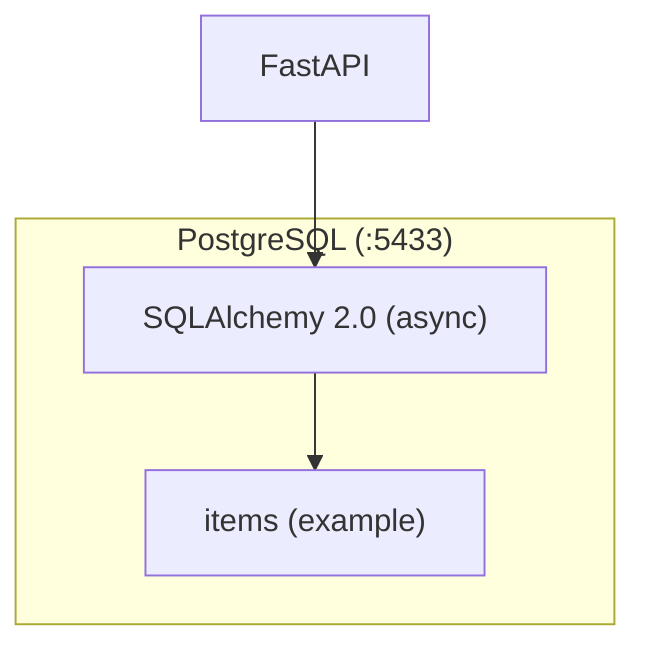
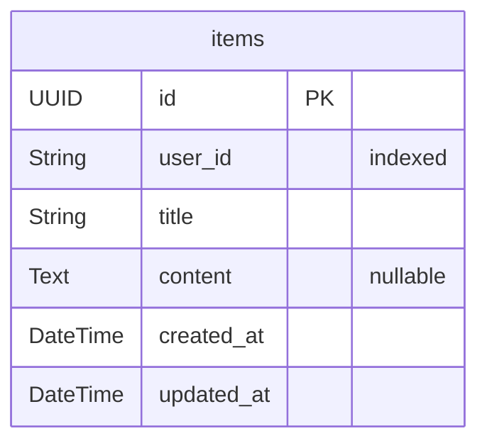

# Database Reference

## Single Database Architecture



| Property | Value |
|----------|-------|
| ORM | SQLAlchemy 2.0 (async) |
| Migration tool | Alembic |
| Used by | FastAPI |
| Config | `apps/api/alembic.ini` |
| Schema location | `apps/api/api/*/models/` |
| Port (local) | 5433 |

## Entity Relationship Diagram



## Models by Module

| Model | Module | Table |
|-------|--------|-------|
| `Item` | `items/` | `items` |

## Base Model

All models inherit timestamps from `BaseModel`:

```python
# api/core/models.py
class BaseModel(DeclarativeBase):
    __abstract__ = True

    created_at: Mapped[datetime] = mapped_column(DateTime(timezone=False), ...)
    updated_at: Mapped[datetime | None] = mapped_column(DateTime(timezone=False), ...)
```

## Migration Commands

```bash
cd apps/api
poetry run alembic revision --autogenerate -m "description"
poetry run alembic upgrade head
```

## Adding a New Table (TDD)

1. **Write a test first** for the CRUD operations in `apps/api/__tests__/`
2. Create SQLAlchemy model in `api/{module}/models/`
3. Create Pydantic schemas in `api/{module}/schemas.py`
4. Create CRUD class in `api/{module}/crud.py` (extend `BaseCrud`)
5. Import model in `migrations/env.py`
6. Generate migration: `poetry run alembic revision --autogenerate -m "add {table}"`
7. Apply migration: `poetry run alembic upgrade head`
8. **Run tests** — verify they pass

## Naming Conventions

| Convention | Example |
|-----------|---------|
| snake_case columns | `user_id`, `created_at` |
| UUID primary keys | `id = mapped_column(UUID(as_uuid=True), primary_key=True)` |
| Auto timestamps | Inherited from `BaseModel` |
| Declarative models | `class Item(BaseModel): ...` |
