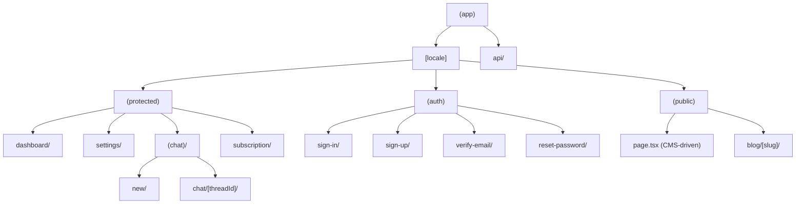

# Frontend Reference — Next.js App

## Quick Navigation

| Area | Path |
|------|------|
| App Router pages | `apps/nextjs/src/app/(app)/[locale]/` |
| Protected pages | `apps/nextjs/src/app/(app)/[locale]/(protected)/` |
| Auth pages | `apps/nextjs/src/app/(app)/[locale]/(auth)/` |
| Public pages | `apps/nextjs/src/app/(app)/[locale]/(public)/` |
| API routes | `apps/nextjs/src/app/(app)/api/` |
| Components | `apps/nextjs/src/components/` |
| Providers | `apps/nextjs/src/components/providers/` |
| Hooks | `apps/nextjs/src/hooks/` |
| Server actions | `apps/nextjs/src/actions/` |
| tRPC routers | `apps/nextjs/src/server/api/routers/` |
| Auth setup | `apps/nextjs/src/server/auth/auth.ts` |
| DB schemas | `apps/nextjs/src/server/db/schemas/` |
| Payload CMS config | `apps/nextjs/payload.config.ts` |
| Payload collections | `apps/nextjs/src/payload/collections/` |
| Payload blocks | `apps/nextjs/src/payload/blocks/` |
| Payload globals | `apps/nextjs/src/payload/globals/` |
| Generated API client | `apps/nextjs/src/lib/api/generated.ts` |
| i18n translations | `apps/nextjs/src/lib/i18n/` |
| Environment config | `apps/nextjs/src/env.js` |
| Middleware | `apps/nextjs/src/middleware.ts` |
| Sentry configs | `apps/nextjs/sentry.*.config.ts` |
| Seed scripts | `apps/nextjs/scripts/` |
| E2E tests | `e2e/` (root level) |

## Where to Put New Code

| You need... | Put it in... |
|-------------|-------------|
| A new protected page | `src/app/(app)/[locale]/(protected)/{page}/page.tsx` |
| A new public page | `src/app/(app)/[locale]/(public)/{page}/page.tsx` |
| A new auth page | `src/app/(app)/[locale]/(auth)/{page}/page.tsx` |
| A React component | `src/components/{feature}/{component-name}.tsx` |
| A custom hook | `src/hooks/use-{name}.ts` |
| A server action | `src/actions/{name}.ts` |
| A tRPC router | `src/server/api/routers/{name}.ts` |
| An API route | `src/app/(app)/api/{name}/route.ts` |
| Translations | `src/lib/i18n/{locale}/{namespace}.json` |
| A shared UI component | `packages/ui/src/components/{name}.tsx` |
| A Payload CMS block | `src/payload/blocks/{name}.ts` + `src/components/content/blocks/{name}.tsx` |
| A Payload collection | `src/payload/collections/{Name}.ts` |
| A Payload global | `src/payload/globals/{Name}.ts` |
| A seed script | `scripts/seed-{name}.ts` |
| An E2E test | `e2e/{project}/{name}.spec.ts` |

## Routing Architecture



All routes are locale-based: `/[locale]/...` (with `localePrefix: "never"` — locale in URL path but no visible prefix).

### Route Groups

| Group | Purpose | Auth |
|-------|---------|------|
| `(protected)/` | Dashboard, settings, chat, subscription | Required (layout checks session + subscription) |
| `(auth)/` | Sign in, sign up, verify, reset | Public (redirects authenticated users to `/new`) |
| `(public)/` | Landing pages, blog, legal | Public (header/footer from CMS template) |
| `api/` | API routes (not locale-prefixed) | Varies |

---

## Payload CMS Architecture

### Collections & Globals

| Type | Slug | Purpose |
|------|------|---------|
| Collection | `pages` | CMS-managed pages (landing, etc.) |
| Collection | `posts` | Blog posts |
| Collection | `categories` | Blog categories |
| Collection | `page-templates` | Page templates (header/footer blocks) |
| Collection | `media` | Uploaded images |
| Global | `plans` | Subscription plan definitions |
| Global | `global-settings` | Site-wide settings (business name, contact, social links) |

### Block System

Payload blocks define the CMS content structure. Each block has a Payload definition (schema) and a React component (renderer):

```typescript
// src/payload/blocks/hero-block.ts — Schema definition
export const HeroBlock: Block = {
  slug: "hero",
  labels: { singular: { lt: "...", en: "..." } },
  fields: [
    { name: "title", type: "text", localized: true, required: true },
    { name: "subtitle", type: "textarea", localized: true },
    { name: "backgroundImage", type: "upload", relationTo: "media" },
    ...ctaButtonField(),  // Reusable field factory
  ],
};

// src/components/content/blocks/hero-block.tsx — React renderer
export function HeroBlock({ block }: { block: HeroBlockData }) {
  return (
    <SectionWrapper background={block.background}>
      <h1>{block.title}</h1>
      {block.subtitle && <p>{block.subtitle}</p>}
      {block.ctaText && <Button asChild><Link href={block.ctaLink}>{block.ctaText}</Link></Button>}
    </SectionWrapper>
  );
}
```

### Reusable Field Factories

```typescript
// src/payload/fields/cta-button.ts
export function ctaButtonField(prefix = "cta"): Field[] {
  return [
    { name: `${prefix}Text`, type: "text", localized: true },
    { name: `${prefix}Link`, type: "text" },
  ];
}
```

### BlocksRenderer Pattern

The central component that maps CMS blocks to React components:

```typescript
// src/components/content/blocks-renderer.tsx (async server component)
export async function BlocksRenderer({ blocks, locale, searchParams }: BlocksRendererProps) {
  // Pre-fetch data needed by blocks (e.g., blog posts for blog-section)
  if (blocks.some(b => b.blockType === "blog-section")) {
    postsResult = await fetchPosts({ locale, limit: 3, sort: "-date" });
  }

  return (
    <>
      {blocks.map((block, index) => {
        switch (block.blockType) {
          case "navbar": return <NavbarWrapper key={index} {...} />;
          case "hero": return <HeroBlock key={index} block={block} />;
          case "faq": return <FaqBlock key={index} block={block} />;
          case "pricing": return <PricingSection key={index} {...} />;
          case "blog-section": return <BlogSection key={index} posts={postsResult} />;
          // ... all block types
          default: return null;
        }
      })}
    </>
  );
}
```

### SectionWrapper

Standard wrapper for content sections with background variants:

```typescript
const bgClasses: Record<string, string> = {
  default: "",
  muted: "bg-muted",
  dark: "bg-gray-900 text-white",
  primary: "bg-primary text-primary-foreground",
};

export function SectionWrapper({ background = "default", noPadding = false, children, className }) {
  return (
    <section className={cn(
      "relative overflow-hidden",
      !noPadding && "py-16 lg:py-24 xl:py-32",
      bgClasses[background ?? "default"],
      className,
    )}>
      {children}
    </section>
  );
}
```

---

## Authentication Patterns

### Auth Layout (redirects authenticated users)

```typescript
export default async function AuthLayout({ children }: Props) {
  const session = await auth.api.getSession({ headers: await headers() });
  if (session?.user?.id) redirect("/new");

  return (
    <div className="flex min-h-screen">
      <AuthSidePanel />
      <div className="flex flex-1 flex-col">
        <header className="flex items-center justify-between p-6">
          <BackButton />
          <LocaleSwitcher />
        </header>
        <main className="flex flex-1 items-center justify-center">{children}</main>
      </div>
    </div>
  );
}
```

### Auth Form Pattern (@tanstack/react-form + Zod)

```typescript
"use client";

export function SignInForm({ callbackURL = "/new" }: { callbackURL?: string }) {
  const form = useForm({
    defaultValues: { email: "", password: "" },
    validators: { onChange: signInSchema },  // Zod schema
    onSubmit: async ({ value }) => {
      const result = await authClient.signIn.email({
        email: value.email,
        password: value.password,
        callbackURL,
      });
      if (result?.error) {
        toast.error(result.error.message);
        return;
      }
      trackEvent(POSTHOG_EVENTS.USER_SIGNED_IN, { method: "email" });
    },
  });

  return (
    <form>
      <AuthFormHeader title={t("title")} subtitle={t("subtitle")} />
      <AuthSocialButton provider="google" />
      <AuthDivider />
      <form.Field name="email">
        {field => (
          <FieldGroup>
            <FieldLabel>{t("email")}</FieldLabel>
            <Input type="email" {...field.getInputProps()} />
            <FieldError>{field.state.meta.errors?.[0]}</FieldError>
          </FieldGroup>
        )}
      </form.Field>
      {/* ... password field, submit button */}
    </form>
  );
}
```

---

## Protected Layout & Subscription Gating

```typescript
export const dynamic = "force-dynamic";  // Auth requires fresh data

export default async function ProtectedLayout({ children }: Props) {
  const session = await auth.api.getSession({ headers: await headers() });
  if (!session?.user.id) redirect("/sign-in");

  let activeSubscription: CustomerStateSubscription | undefined;
  try {
    const state = await auth.api.state({ headers: await headers() });
    activeSubscription = state.activeSubscriptions[0];
  } catch (error) {
    console.warn("Failed to fetch customer state", error);
  }

  return (
    <div className="flex h-screen w-full overflow-hidden">
      <DashboardSideBar />
      <main className="flex-1 overflow-hidden">
        {env.NEXT_PUBLIC_PAYWALL_ENABLED ? (
          <SubscriptionGuard hasSubscription={!!activeSubscription}>
            {children}
          </SubscriptionGuard>
        ) : children}
      </main>
    </div>
  );
}
```

### SubscriptionGuard

Client component that redirects unsubscribed users to `/subscription`, with exemptions for settings and subscription pages:

```typescript
"use client";
const EXEMPT_SEGMENTS = ["/settings", "/subscription"];

export function SubscriptionGuard({ hasSubscription, children }) {
  const pathname = usePathname();
  const isExempt = EXEMPT_SEGMENTS.some(seg => pathname.includes(seg));
  const shouldBlock = !hasSubscription && !isExempt;

  useEffect(() => {
    if (shouldBlock) {
      const locale = pathname.split("/")[1];
      router.replace(`/${locale}/subscription`);
    }
  }, [shouldBlock]);

  if (shouldBlock) return null;
  return <>{children}</>;
}
```

---

## Chat Components

### ThreadChat (main chat container)

```typescript
"use client";

export function ThreadChat({ threadId }: ThreadChatProps) {
  const { messages, sendMessage, isLoading } = useCopilotChatHeadless_c();
  const [input, setInput] = useState("");

  const handleSend = useCallback(() => {
    trackEvent(POSTHOG_EVENTS.CHAT_MESSAGE_SENT, { thread_id: threadId });
    void sendMessage({
      id: crypto.randomUUID(),
      role: "user",
      content: input,
    });
    setInput("");
  }, [input, threadId]);

  return (
    <>
      <ThreadHeader />
      <ChatMessagesView messages={messages} />
      <ChatInput onSend={handleSend} />
    </>
  );
}
```

### useChatAgent Hook

```typescript
"use client";

export function useChatAgent() {
  const locale = useLocale();
  const { state, setState } = useCoAgent<AgentState>({
    name: "app_agent",
    initialState: { language: locale },
  });

  // Register tool renders here

  return { agentName: "app_agent", agentState: state };
}
```

### ChatsListView (infinite scroll thread list)

```typescript
"use client";

export function ChatsListView() {
  const { data, fetchNextPage, hasNextPage, isFetchingNextPage } = useInfiniteQuery(
    trpc.threads.list.infiniteQueryOptions({ limit: PAGE_SIZE }, {
      getNextPageParam: (lastPage, allPages) => ...
    })
  );

  // IntersectionObserver for infinite scroll
  useEffect(() => {
    const observer = new IntersectionObserver(
      ([entry]) => {
        if (entry?.isIntersecting && hasNextPage && !isFetchingNextPage) void fetchNextPage();
      },
      { threshold: 0.1 }
    );
    observer.observe(sentinelRef.current);
    return () => observer.disconnect();
  }, [hasNextPage, isFetchingNextPage, fetchNextPage]);

  return (
    <div className="flex flex-1 flex-col">
      {/* Search bar, thread list, sentinel div for infinite scroll */}
    </div>
  );
}
```

---

## Data Pages (Context Pattern)

### DataProvider

Fetches domain data once and shares it across related pages via React context:

```typescript
"use client";

const DataContext = createContext<ResultData | null>(null);

export function useResultData() {
  const data = useContext(DataContext);
  if (!data) throw new Error("useResultData must be used within DataProvider");
  return data;
}

export function DataProvider({ children }: { children: ReactNode }) {
  const { data: result, isLoading } = useGetMyItemApiV1ItemsMeGet({ locale });
  const deleteMutation = useDeleteMyItemApiV1ItemsMeDelete({
    mutation: {
      onSuccess: () => void queryClient.invalidateQueries({
        queryKey: getGetMyItemApiV1ItemsMeGetQueryKey({ locale }),
      }),
    },
  });

  if (isLoading) return <LoadingSpinner />;
  if (!result) return <CreateItemPrompt />;

  return (
    <DataContext.Provider value={result.data}>
      <div className="min-w-0 flex-1">
        <div className="flex items-center justify-end gap-2 mb-6">
          <Button onClick={() => deleteMutation.mutate()}>Delete</Button>
        </div>
        {children}
      </div>
    </DataContext.Provider>
  );
}
```

### Section Page Pattern

Each section page consumes data from the shared DataProvider context:

```typescript
"use client";

export default function SectionPage() {
  const data = useResultData();  // From context
  const { section } = data;
  const t = useTranslations("dashboard.section");

  if (!section.items.length) {
    return <div>{t("emptyStates.noData")}</div>;
  }

  return (
    <div className="flex flex-col">
      <Section title={t("sections.title")} first>
        <div className="divide-y">
          {section.items.map((item, i) => (
            <div key={i} className="space-y-1 py-4">
              <span className="font-medium">{item.name}</span>
            </div>
          ))}
        </div>
      </Section>
    </div>
  );
}
```

---

## Public Pages (CMS-Driven)

### Home Page

```typescript
const HOME_PAGE_SLUG = "home";
export const dynamic = "force-dynamic";

export default async function Home({ params }: { params: Promise<{ locale: string }> }) {
  const { locale } = await params;
  const page = await fetchPage({ slug: HOME_PAGE_SLUG, locale });

  if (!page) {
    return <p>Landing page not found. Run seed scripts.</p>;
  }

  return (
    <main className="w-full">
      <BlocksRenderer blocks={page.layout} locale={locale} />
    </main>
  );
}
```

### Public Layout (template-driven header/footer)

```typescript
export default async function PublicLayout({ children }: { children: ReactNode }) {
  const locale = await getLocale();
  const template = await fetchPageTemplate("Default");

  return (
    <div className="min-h-screen">
      <RefreshRouteOnSave />
      {template?.header?.length > 0 && <BlocksRenderer blocks={template.header} locale={locale} />}
      {children}
      {template?.footer?.length > 0 && <BlocksRenderer blocks={template.footer} locale={locale} />}
    </div>
  );
}
```

---

## Server Actions & Data Fetching

### Cached Data Fetching Pattern

Server actions use `unstable_cache` with tags for ISR:

```typescript
"use server";

export async function fetchPage({ slug, locale }: { slug: string; locale: string }) {
  return unstable_cache(
    async () => {
      const payload = await getPayload({ config });
      const result = await payload.find({
        collection: "pages",
        where: { slug: { equals: slug }, status: { equals: "published" } },
        locale: locale as "lt" | "en",
        depth: 2,
      });
      return result.docs[0] as Page | undefined;
    },
    [`page-${slug}-${locale}`],
    { tags: ["pages", `page-${slug}`], revalidate: 3600 }
  )();
}
```

### Blog Fetching with Filters

```typescript
"use server";

export async function fetchPosts({
  locale, page = 1, limit = 12, category, search, sort = "-date",
}: FetchPostsParams) {
  return unstable_cache(
    async () => {
      const payload = await getPayload({ config });
      const where: any = { status: { equals: "published" } };

      if (category) {
        const cat = await payload.find({ collection: "categories", where: { slug: { equals: category } } });
        if (cat.docs[0]) where["content.category"] = { in: [cat.docs[0].id] };
      }
      if (search) {
        where.or = [
          { title: { contains: search } },
          { "content.description": { contains: search } },
        ];
      }

      return await payload.find({ collection: "posts", where, locale, depth: 3, limit, page, sort });
    },
    [`posts-${locale}-${page}-${limit}-${category || ""}-${search || ""}-${sort}`],
    { tags: ["posts", "blog"], revalidate: 3600 }
  )();
}
```

### Fetching Plans

```typescript
"use server";

export async function fetchAllPlans(localeParam?: string): Promise<PlanItem[]> {
  const payload = await getPayload({ config });
  const locale = localeParam ?? (await getLocale());
  const plansData = await payload.findGlobal({
    slug: "plans",
    locale: locale as "lt" | "en",
    fallbackLocale: env.NEXT_PUBLIC_DEFAULT_LOCALE,
    depth: 2,
  });

  return [...(plansData?.plans || [])]
    .filter(plan => plan.isActive !== false)
    .sort((a, b) => (a.sortOrder || 0) - (b.sortOrder || 0));
}
```

---

## Pricing & Subscription

### PlansGrid (async server component with auth)

```typescript
export async function PlansGrid({ locale: localeProp }: PlansGridProps) {
  const locale = localeProp ?? (await getLocale());
  const plans = await fetchAllPlans(locale);

  let activeSubscriptions: Array<{ productId: string }> = [];
  try {
    const state = await auth.api.state({ headers: await headers() });
    activeSubscriptions = state.activeSubscriptions || [];
  } catch { /* not authenticated */ }

  return (
    <div className="grid w-full grid-cols-1 gap-6 md:grid-cols-2">
      {plans.map(plan => (
        <PricingPlanCard
          key={plan.key}
          plan={plan}
          isCurrentPlan={activeSubscriptions.some(s => s.productId === plan.productKey)}
        />
      ))}
    </div>
  );
}
```

### PricingSection with Suspense

```typescript
export function PricingSection({ title, subtitle }: PricingSectionProps) {
  return (
    <section id="pricing" className="bg-muted/50 w-full py-16">
      <div className="container mx-auto px-4">
        <Suspense fallback={<PlansLoading />}>
          <PlansGrid />
        </Suspense>
      </div>
    </section>
  );
}
```

---

## Navbar & Footer

### Navbar (client component with scroll detection)

```typescript
"use client";

export function Navbar({ navItems, ctaButton, appName }: NavbarProps) {
  const [isScrolled, setIsScrolled] = useState(false);
  const { data: session } = authClient.useSession();
  const isAuthenticated = !!session?.user;

  useEffect(() => {
    const handleScroll = () => setIsScrolled(window.scrollY > 10);
    window.addEventListener("scroll", handleScroll);
    return () => window.removeEventListener("scroll", handleScroll);
  }, []);

  return (
    <nav className={cn(
      "fixed top-0 right-0 left-0 z-50 w-full transition-all duration-300",
      isScrolled ? "bg-background/95 border-b backdrop-blur-sm" : "border-b border-transparent bg-transparent"
    )}>
      {/* Logo, nav links, locale switcher, auth-aware CTA */}
    </nav>
  );
}
```

### Footer (async server component with global settings)

```typescript
export default async function Footer({ sections }: FooterProps) {
  const locale = await getLocale();
  const settings = await fetchGlobalSettings(locale);
  const { contactEmail, contactPhone, contactAddress, socialLinks } = settings.contactInfo;

  return (
    <footer className="border-border border-t py-12">
      {/* Logo + CMS footer sections + Contact info + Social links + Copyright */}
    </footer>
  );
}
```

---

## Seed Scripts

Idempotent scripts that populate CMS content:

```typescript
// scripts/seed-landing.ts
// Usage: pnpm --filter nextjs db:seed-landing

async function main() {
  const payload = await getPayload({ config });

  // Delete existing page
  const existing = await payload.find({ collection: "pages", where: { slug: { equals: "home" } } });
  for (const page of existing.docs) await payload.delete({ collection: "pages", id: page.id });

  // Create with localized blocks
  await payload.create({
    collection: "pages",
    locale: "en",
    data: {
      title: "Home",
      slug: "home",
      status: "published",
      layout: [
        { blockType: "hero", title: "...", ctaText: "...", ctaLink: "/sign-in" },
        // ... more blocks
      ],
    },
  });
}
```

---

## i18n

### Routing Configuration

```typescript
// src/lib/i18n/routing.ts
export const routing = defineRouting({
  locales: env.NEXT_PUBLIC_ALL_LOCALES as [string, ...string[]],  // e.g. ["en", "lt"]
  defaultLocale: env.NEXT_PUBLIC_DEFAULT_LOCALE ?? "en",
  localePrefix: "never",  // No visible /en/ or /lt/ prefix in URLs
});
```

### Middleware

```typescript
// src/middleware.ts
import createMiddleware from "next-intl/middleware";
import { routing } from "@/lib/i18n/routing";

export default createMiddleware(routing);

export const config = {
  matcher: ["/((?!api|ingest|_next|_vercel|admin)(?!.*\\..*).*)"],
};
```

### Usage Patterns

```typescript
// Server components
import { getTranslations, getLocale } from "next-intl/server";
const t = await getTranslations({ locale, namespace: "dashboard.items" });

// Client components
import { useTranslations, useLocale } from "next-intl";
const t = useTranslations("dashboard.items");

// Payload CMS: localized: true on text fields
// Server actions: always pass locale to data-fetching functions
```

---

## Error Handling

### Global Error

```typescript
"use client";
export default function GlobalError({ error, reset }: GlobalErrorProps) {
  useEffect(() => { Sentry.captureException(error); }, [error]);
  return (
    <html lang="en"><body>
      <h1>Something went wrong</h1>
      <button onClick={reset}>Try again</button>
    </body></html>
  );
}
```

### Not Found

```typescript
export default async function RootNotFound() {
  const locale = await getLocale();
  const t = await getTranslations({ locale, namespace: "common" });
  return (
    <html lang={locale}><body>
      <p className="text-[12rem] font-black">404</p>
      <h1>{t("pageNotFound")}</h1>
      <Link href={`/${locale}`}>← {t("goHome")}</Link>
    </body></html>
  );
}
```

---

## Data Fetching Decision Tree

| Data source | Method | When to use |
|------------|--------|-------------|
| Frontend DB | tRPC | Threads, CopilotKit state, internal data |
| Backend API | Generated Axios client (`orval`) | Domain items from FastAPI |
| Payload CMS | `getPayload` + `unstable_cache` | Pages, posts, categories, plans, settings |
| Auth | Better Auth client | Session, user info, subscription state |
| Server-only | Server Actions | Mutations (auth, email, subscriptions) |

## Component Patterns Summary

| Pattern | Where | Example |
|---------|-------|---------|
| Server component (default) | Pages, layouts | `async function Page()` — fetch data, render |
| Client component | Interactive UI | `"use client"` — hooks, state, event handlers |
| Context provider | Shared state | `DataProvider` — wraps domain data pages |
| Suspense boundary | Async loading | `<Suspense fallback={<Loading />}><AsyncComponent /></Suspense>` |
| Form with validation | Auth, settings | `@tanstack/react-form` + Zod schema |
| Infinite scroll | Lists | `useInfiniteQuery` + IntersectionObserver |
| CMS block rendering | Landing pages | BlocksRenderer → switch on blockType |

## Environment Variables (t3-env)

Environment variables are validated at build time using **t3-env** (`@t3-oss/env-core`). This catches missing or invalid env vars before they cause runtime errors.

- **Next.js app:** `apps/nextjs/src/env.ts` — uses `NEXT_PUBLIC_` prefix
- **Vite apps (if added):** Use `import.meta.env` only (never `process.env`), with `envPrefix: ["VITE_", "PUBLIC_"]` in vite config
- **api-client package:** Defines its own env schema; the app's env config `extends` it

```typescript
// Example: extending api-client env in the app
import { createEnv } from "@t3-oss/env-nextjs";
import { apiClientEnv } from "@packages/api-client/env";

export const env = createEnv({
  extends: [apiClientEnv],
  client: { NEXT_PUBLIC_APP_URL: z.string().url() },
  // ...
});
```

## Key Libraries

| Library | Purpose | Import |
|---------|---------|--------|
| Next.js 15 | Framework (App Router, RSC) | — |
| React 19 | UI rendering | `react` |
| shadcn/ui | UI components | `@packages/ui/components/*` |
| Tailwind CSS | Styling | utility classes |
| next-intl | i18n | `next-intl`, `next-intl/server` |
| Better Auth | Authentication | `@/server/auth/auth` |
| Polar SDK | Payments | `@polar-sh/sdk`, `@polar-sh/better-auth` |
| CopilotKit | AI chat | `@copilotkit/react-core`, `@copilotkit/react-ui` |
| @tanstack/react-form | Form state + validation | `@tanstack/react-form` |
| @tanstack/react-query | Server state / mutations | `@tanstack/react-query` |
| tRPC | Type-safe frontend DB queries | `@/server/trpc` |
| orval | Generated API client | `@/lib/api/generated` |
| Payload CMS | Content management | `payload` |
| Drizzle ORM | Frontend database | `drizzle-orm` |
| PostHog | Analytics | `@packages/analytics` |
| Sentry | Error tracking | `@sentry/nextjs` |
| Zod | Schema validation | `zod` |
| React Email | Email templates | `@packages/email` |

!!! note "Alternative form library: React Hook Form + shadcn Form"
    For Vite/SPA projects (e.g., TanStack Router apps), **React Hook Form + Zod + shadcn Form** is the validated alternative. Use `satisfies z.ZodType<T>` to tie Zod schemas to Orval-generated types. This template uses @tanstack/react-form since it was chosen before validation; both approaches work well.
