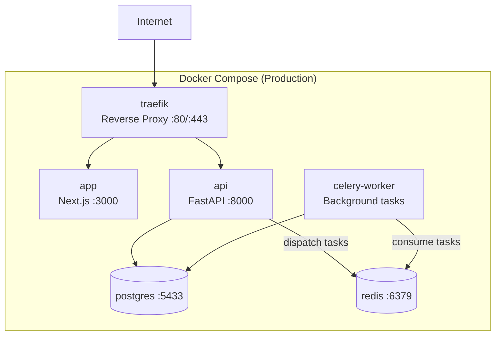
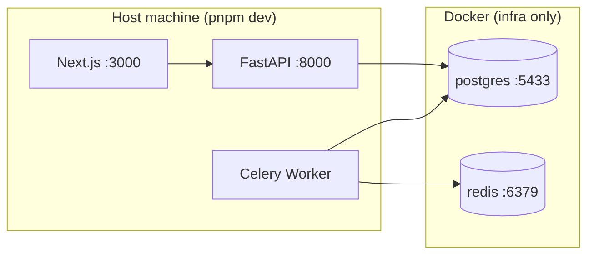

# Infrastructure Reference

## Production Architecture



## Local Development Architecture



### Prerequisites

- Node.js 20
- Python 3.12
- Docker (for PostgreSQL, Redis)

### Setup

```bash
pnpm install                    # Install all JS/TS deps
cd apps/api && poetry install   # Install Python deps
docker compose -f docker-compose.local.yml up -d  # Start infra services
pnpm db:migrate                 # Run all migrations
```

### Running

```bash
pnpm dev                        # Start all apps (Turbo)
```

Or individually:

```bash
# Frontend
cd apps/nextjs && pnpm dev

# Backend
cd apps/api && poetry run start

# Celery worker
cd apps/api && poetry run celery-worker
```

**Local Docker services** (`docker-compose.local.yml`):

| Service | Port | Purpose |
|---------|------|---------|
| redis | 6379 | Celery broker/backend |
| postgres | 5433 | Database (FastAPI) |

## Environment Variables

### Where env vars are configured

| App | Config File | Validation |
|-----|------------|------------|
| Frontend | `apps/nextjs/src/env.js` | `@t3-oss/env-nextjs` + Zod |
| Backend | `apps/api/api/settings.py` | Pydantic `BaseSettings` (`API_` prefix) |

### Required variables by service

| Service | Required Variables |
|---------|--------------------|
| api | `API_DATABASE_URL`, `API_SECRET_KEY` |
| celery-worker | `API_DATABASE_URL`, `API_CELERY_BROKER_URL`, `API_CELERY_RESULT_BACKEND` |

### Optional observability

| Variable | Purpose |
|----------|---------|
| `API_SENTRY_DSN` | Backend error tracking |
| `NEXT_PUBLIC_SENTRY_DSN` | Frontend error tracking |
| `NEXT_PUBLIC_POSTHOG_KEY` | Product analytics |
